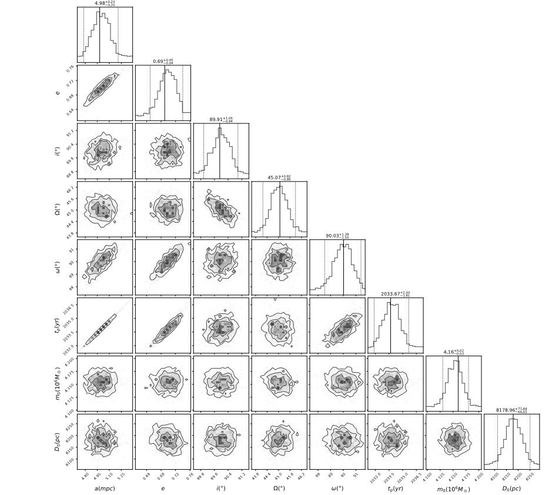
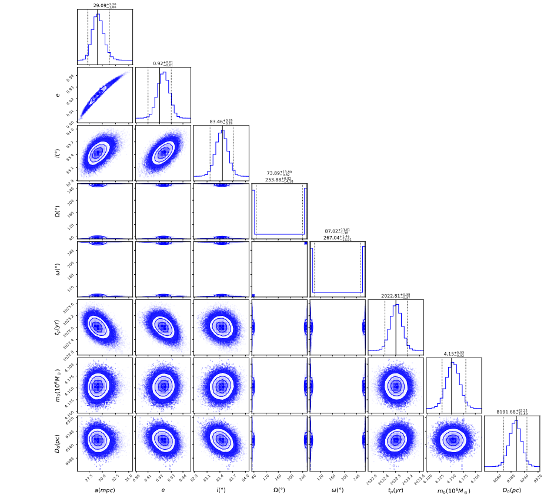
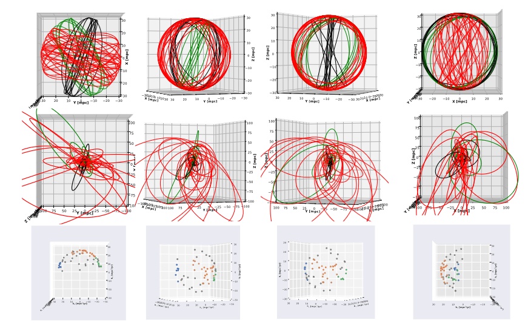

# astro-calc

This repository demonstrates the application of statistics and machine learning on astrophysical systems for purposes of orbital and dynamical interpretations and calculations. 

The current project explores the following methods: 

* Bilby- MCMC (https://arxiv.org/abs/2106.08730)
* Ultranest (https://johannesbuchner.github.io/UltraNest/index.html)
* HDBSCAN (https://hdbscan.readthedocs.io/en/latest/how_hdbscan_works.html)

The first two apporches are used to derive the orbital elements for objects that lack radial velocity data, while the third is employed to find any meaningful structure.

**Key Findings**

**Bilby-MCMC**

According to the figure, the method fails to find the second modes of both of the arugment of the pericenter and the longitude of ascending node, which are expected in the case, where radial velocity data are missing. 

**Ultranest**

As demonstrated above nested sampling methods perform significantly better than the traditional MCMC methods. 

**HDBSCAN**

After obtaining the orbits, one could perform HDBSCAN to obtain any valuable conclusions and information about the studied objects.

Author

Dr. Basel Ali
